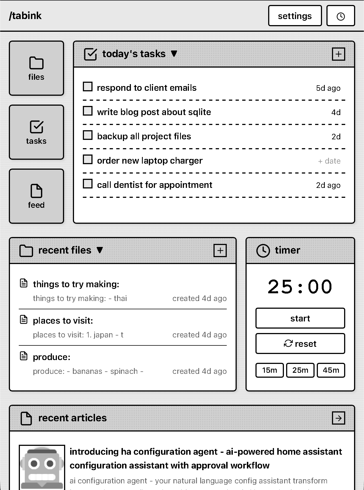
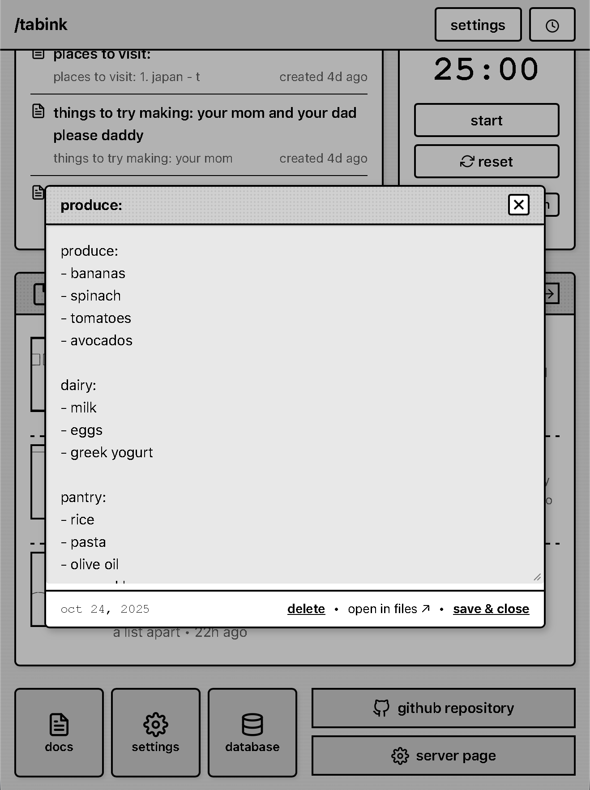

# Tabink

**Offline-first productivity app for Android tablets**

A Newton MessagePad-inspired PWA featuring notes, sketches, tasks, RSS feed reader, and timer—all stored locally with SQLite and IndexedDB.

---

## 📸 Screenshots

*Widget dashboard with app icons, tasks, files, and timer*

*Files and tasks interface*

---

## 🚀 Get Started

**Try It Online:** [https://hunterstroud89.github.io/tabink-v3/](https://hunterstroud89.github.io/tabink-v3/)

**Install APK (Android):**
1. Download latest APK from [releases](https://github.com/hunterstroud89/tabink-v3/releases)
2. Enable "Install from Unknown Sources" in Android settings
3. Install and launch Tabink

---

## ✨ Features

- 📝 **Files** - Notes and sketches with auto-save
- ✅ **Tasks** - Simple task management with due dates
- 📰 **RSS Feed Reader** - Subscribe to any RSS/Atom feed
- ⏱️ **Timer** - Countdown timer with presets (15m, 25m, 45m)
- 🎨 **E-Ink Optimized** - Newton MessagePad-inspired design
- 💾 **100% Offline** - All data stored locally, no cloud
- 🔒 **Privacy First** - No tracking, no analytics, no accounts

---

## 🏗️ Tech Stack

- **Frontend:** Vanilla JavaScript (no frameworks)
- **Database:** SQL.js (SQLite via WebAssembly)
- **Storage:** IndexedDB (1-10 GB capacity)
- **UI:** Custom ePaperCSS (Newton MessagePad-inspired)
- **Offline:** Service Worker with asset caching

---

## � Documentation

- **[Developer Notes](./assets/documents/dev-notes.md)** - Build instructions, architecture, troubleshooting, and complete technical documentation

---

## 📄 License

MIT License - Feel free to use, modify, and distribute.

---

**Built with ❤️ for offline productivity on tablets**
